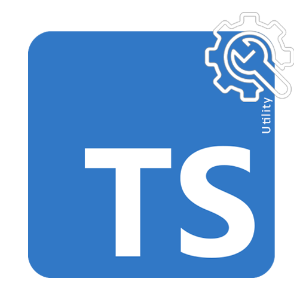

<p align="center" float="left">
     
     
</p>

# CSV Exporter Utility

## Description

CSV Exporter Utility is a simple, yet powerful package that allows you to easily convert a JSON array of data into a CSV file and download it in a user-friendly way. This utility is highly useful when you need to export data from a web application or API to a CSV file format, which can then be imported into other tools or processed further.

## Why use CSV Exporter Utility

- Easy to integrate into your existing projects
- Lightweight with no external dependencies
- Handles complex JSON data structures and nested objects
- Automatically generates CSV headers from JSON keys
- Cross-browser compatibility
- User-friendly file download experience

## How to use CSV Exporter Utility

1. Install the package using npm or yarn:

```bash
npm install @arslanameer/csv-exporter-utility
```

2. Import the `downloadCSVFile` function from the package:

```typescript
import { downloadCSVFile } from "@arslanameer/csv-exporter-utility";
```

3. Use the `downloadCSVFile` function in your application to convert and download JSON data as a CSV file:

```typescript
const jsonData = [
  { id: 1, name: "John Doe", email: "john@example.com" },
  { id: 2, name: "Jane Doe", email: "jane@example.com" },
];

downloadCSVFile(jsonData, "users");
```

The above example will download a CSV file named `users.csv` containing the data from the `jsonData` array.

## When to use CSV Exporter Utility

Use CSV Exporter Utility when you need to:

- Export data from your web application to a CSV file
- Provide users with a simple way to download data in a structured format
- Convert JSON data to CSV for further processing or analysis
- Integrate a lightweight CSV export solution without external dependencies

## Requirements and dependencies

CSV Exporter Utility is written in TypeScript and has no external dependencies. However, you need to ensure that your project uses TypeScript and has the necessary TypeScript configuration in place.

To use this package, your project should have the following:

- TypeScript version 4.x or higher
- A properly configured `tsconfig.json` file
- Node.js version 12.x or higher (if using the package in a Node.js environment)

For more information on setting up TypeScript in your project, please refer to the [official TypeScript documentation](https://www.typescriptlang.org/docs/).

## License

This project is licensed under the [MIT License](https://opensource.org/licenses/MIT). You are free to use, modify, and distribute this package, provided that you include the copyright notice and the license text. For more information, please see the [LICENSE](./LICENSE) file.

## Author

CSV Exporter Utility is developed and maintained by [Arslan Ameer](https://github.com/arslanameer). If you have any questions or need help, feel free to open an issue on the [GitHub repository](https://github.com/arslanameer/csv-exporter-utility).

## Contributing

Contributions to CSV Exporter Utility are welcome and greatly appreciated! If you would like to contribute, please follow these steps:

1. Fork the repository on GitHub.
2. Clone your fork and create a new branch for your changes.
3. Commit and push your changes to your fork.
4. Create a Pull Request on the original repository, describing your changes and referencing any related issues.

Please make sure to follow the existing coding style and add tests for any new features or bug fixes. Your contributions will be reviewed and, if approved, merged into the main repository.

Thank you for your interest in contributing to CSV Exporter Utility!